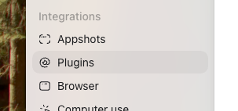
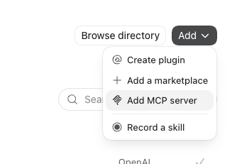
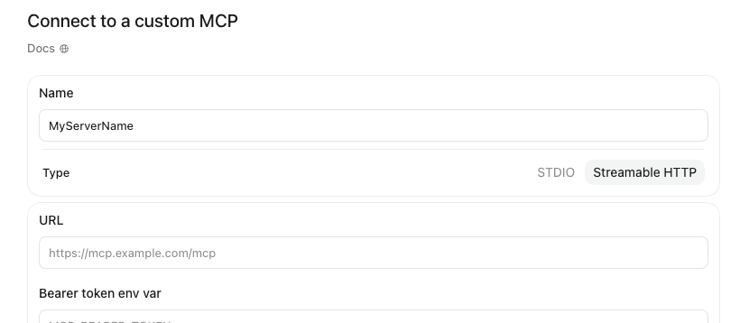

# RingEX Phone Setup

**Server URL:** `https://mcp.labs.ringcentral.com/ringex/v1.1.0/phone`

---

## Install the plugin

The fastest way to connect RingEX Phone is an official plugin — it handles server configuration for you, so there's nothing to side-load manually.

A dedicated Claude plugin for RingEX Phone is on the way.

Coming soon

Install the official RingCentral Phone plugin — no manual setup required.

<a href="https://chatgpt.com/plugins/plugin_asdk_app_6a5163accce48191ab3fac53d63cb197?q=ringcentral" class="rc-install-card__cta rc-install-card__cta--primary" target="_blank" rel="noopener">Install plugin →</a>

---

## Installing the MCP server manually

No plugin for your client, or you'd rather add the server directly? Follow the steps below.

=== "ChatGPT"

    ChatGPT calls this an **App** (renamed from "Connector" in December 2025). Connecting a server that can call tools — not just read/fetch — requires Developer Mode.

    1. **Business/Enterprise/Edu workspaces:** a workspace admin enables Developer Mode via **Workspace Settings → Permissions & Roles → Connected Data**. **Individual Enterprise/Edu accounts, or Pro (read/fetch-only):** go to **Settings → Apps → Advanced Settings** and toggle **Developer mode** on.
    2. In **Settings → Apps**, click **Create**, enter the URL above as the MCP Server URL, name it (e.g. `RingEX Phone`), click **Scan Tools**, then **Save**.
    3. Complete the RingCentral OAuth flow when prompted.
    4. Open a new chat, click the **+** icon or tools menu, and select RingEX Phone — or mention it by name in your prompt.
    5. Verify: ask "Show me my call logs from today."

    !!! note "Pro users"
        With read/fetch-only Developer Mode, you can read call log and message data but can't use any write-type tools.

=== "Claude"

    Custom connectors live under **Customize > Connectors** (Claude.ai) or **Settings → Connectors** (Claude Desktop) — not through `claude_desktop_config.json`, which only supports local stdio servers.

    1. Sign in to [claude.ai](https://claude.ai), or open Claude Desktop.
    2. **Pro/Max:** go to **Customize > Connectors** → click **+** → **Add custom connector**. **Team/Enterprise:** an Owner first adds it under **Organization settings > Connectors** → **Add** → hover **Custom** → select **Web**; members then connect individually via **Customize > Connectors**.
    3. Enter a name (e.g. `RingEX Phone`) and the URL above, then click **Add**.
    4. Complete the RingCentral OAuth flow: sign in with your RingCentral account and authorize the integration.
    5. In a new conversation, click the **+** button (lower left of the chat box) → **Connectors**, and toggle RingEX Phone on.
    6. Verify: ask "Show me my call logs from today."

=== "Codex"

    1. Open the Codex app, click **Settings**, then under **Integrations** click **Plugins**.

        

    2. Click the **MCP** tab, then click **Add → Add MCP server**.

        

    3. Enter a name (e.g. `RingEX Phone`), set Type to **Streamable HTTP**, and enter the Server URL above.

        

    4. Save, then authenticate with your RingCentral account in the browser window that opens.
    5. Codex has no connector picker — mention "RingCentral" explicitly in your prompt, e.g. "Using RingCentral, show me my call logs from today."

---

## Troubleshooting

**Tools not appearing after connecting**

- Confirm the URL has no trailing slash.
- Disconnect and reconnect the server from your client's connector/app settings.
- Check that your network allows outbound HTTPS to `*.ringcentral.com` and `*.labs.ringcentral.com`.

**Authentication errors**

- Remove the connector/app and re-add it to restart the OAuth flow.
- Ensure your RingCentral account has the necessary API permissions.

---

[← Back to RingEX Phone](ringex-phone.md)
