# Claude for Small Business + RingCentral

Install the RingCentral plugin, connect your phone and Team Chat, add Claude for Small Business, and link your CRM. Every step, in order. **~15 minute setup.**

---

## Before you start

You'll need:

- **Claude Desktop app**, signed in to your Claude account
- **RingCentral RingEX account**, you'll sign in during setup
- **Optional**: a CRM account (HubSpot, monday.com, Salesforce, or Zoho CRM)
- **Optional**: an email connector, so Claude can send follow-up emails

---

## Part 1: Install the RingCentral plugin

### Step 1 — Open Customize

In Claude Desktop, open **Customize**. You'll see three tabs: **Skills**, **Connectors**, and **Plugins**.

### Step 2 — Search the directory

Select **Discover**, then enter `ringcentral` in the search box.

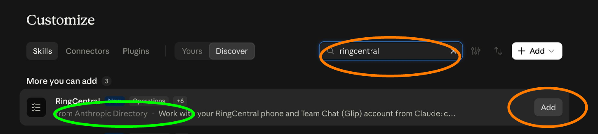

### Step 3 — Add the official RingCentral plugin

Find **RingCentral** labeled **from Anthropic Directory**. Its description reads: "Work with your RingCentral phone and Team Chat (Glip) account from Claude."

Click **Add**.

!!! tip "Pick the right listing"
    Look for the **from Anthropic Directory** label under the plugin name. That's the official RingCentral plugin.

### Step 4 — Confirm the plugin is on

The plugin page opens. Check three things:

- The header reads **RingCentral**, **from Anthropic Directory**, **16 skills**
- The toggle at the top right is **blue** (on)
- You see four tabs: **Overview**, **Contents**, **Skills · 16**, **Connectors · 2**

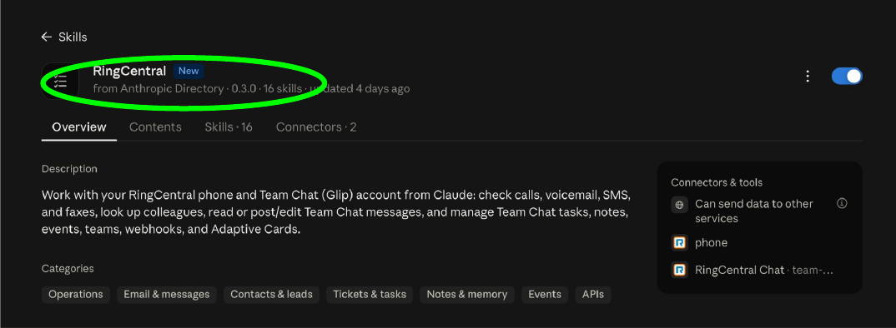

---

## Part 2: Explore what's inside

Each tab on the plugin page tells you something different:

| Tab | What you'll find |
|-----|------------------|
| **Overview** | Description, categories, and the connectors and tools the plugin uses |
| **Contents** | Every file that ships with the plugin |
| **Skills · 16** | Ready-made workflows for calls, SMS, voicemail, fax, and Team Chat |
| **Connectors · 2** | The two RingCentral connections: RingEX Phone and RingCentral Chat |

### Two ways to use a skill

The Skills tab says it plainly: "Invoke by typing / in chat, or let Claude use them automatically for relevant tasks."

- **Type a slash command**, like `` `/voicemail-inbox` ``, to run a skill directly
- **Ask in plain words**, like "Did anyone leave me a voicemail?", and Claude picks the right skill

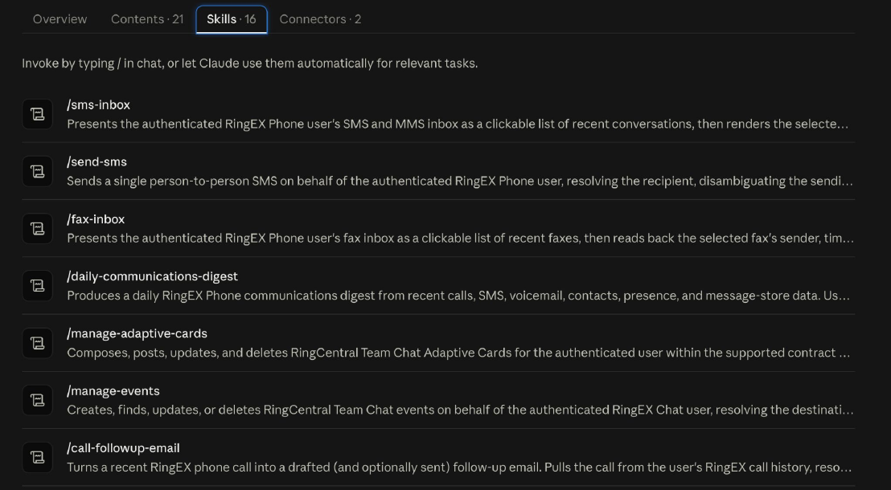

### All 16 RingCentral skills

| Skill | Uses | What it does |
|-------|------|--------------|
| `/colleague-lookup` | RingEX Phone | Find a colleague by name, department, title, or number |
| `/call-recap` | RingEX Phone | Recap a call with AI notes, transcript, and recording status |
| `/call-followup-email` | RingEX Phone | Turn a recent call into a ready-to-send follow-up email |
| `/daily-communications-digest` | RingEX Phone | Turn calls, SMS, and voicemail into a prioritized to-do report |
| `/send-sms` | RingEX Phone | Text one person from a RingEX number you own, with confirmation |
| `/sms-inbox` | RingEX Phone | Browse recent SMS and MMS conversations |
| `/voicemail-inbox` | RingEX Phone | Check voicemail with caller, time, and transcript |
| `/fax-inbox` | RingEX Phone | Browse recent faxes with sender, time, and cover-page text |
| `/post-to-chat` | RingCentral Chat | Send a Team Chat post to a person or channel, with confirmation |
| `/read-team-chat` | RingCentral Chat | Catch up on a chat or channel |
| `/manage-tasks` | RingCentral Chat | Create, assign, update, and complete Team Chat tasks |
| `/manage-notes` | RingCentral Chat | Create, edit, publish, and lock Team Chat notes |
| `/manage-events` | RingCentral Chat | Schedule, change, or cancel Team Chat events |
| `/manage-teams` | RingCentral Chat | Create teams and manage members |
| `/manage-webhooks` | RingCentral Chat | Set up incoming webhooks that post into a channel |
| `/manage-adaptive-cards` | RingCentral Chat | Post status, link, and approval cards |

!!! info "Skills are plain text you can read"
    Every skill is a human-readable SKILL.md file. Browse the full library at [developers.ringcentral.com/mcp/skills](https://developers.ringcentral.com/mcp/skills/). Each page shows the skill ID, the server it uses, the full instructions, and a **Download SKILL.md** button.

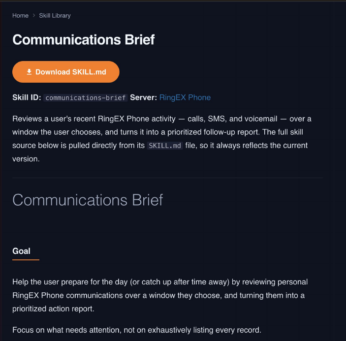

---

## Part 3: Connect RingEX Phone and Team Chat

The plugin needs two connections before it can see your calls and chats. You'll connect each one once.

### Step 5 — Open the Connectors tab

On the RingCentral plugin page, select **Connectors · 2**. You'll see **phone** and **RingCentral Chat**, both marked **Not added**.

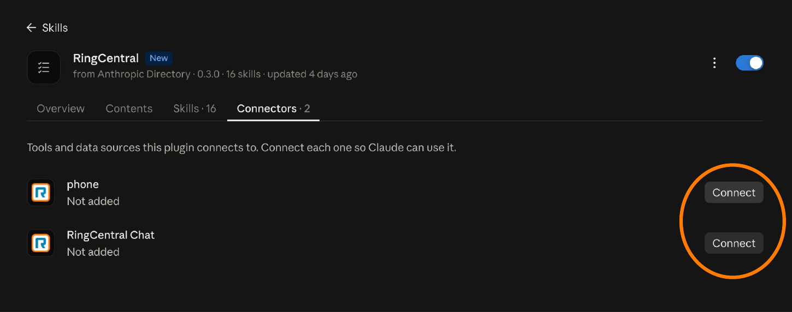

### Step 6 — Connect RingEX Phone

Click **Connect** next to **phone**. Your browser opens a page titled **Finish connecting a connector?**

Click **Continue connecting**.

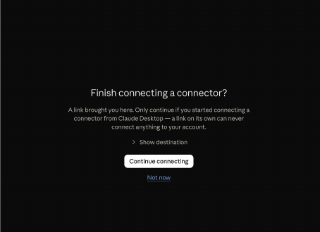

!!! warning "Only continue if you started it"
    This page appears because you clicked Connect in Claude Desktop. If you ever see it without starting a connection, click **Not now**. A link on its own can never connect anything to your account.

### Step 7 — Sign in and click Authorize

Sign in to RingCentral if asked. An **Access Request** page opens: "MCP_Phone is requesting access to RingCentral."

Review the list, then click **Authorize**.

### Step 8 — Repeat for RingCentral Chat

Back in Claude, click **Connect** next to **RingCentral Chat**. Click **Continue connecting**.

On the page that reads "MCP_TeamChat is requesting access to RingCentral," click **Authorize**.

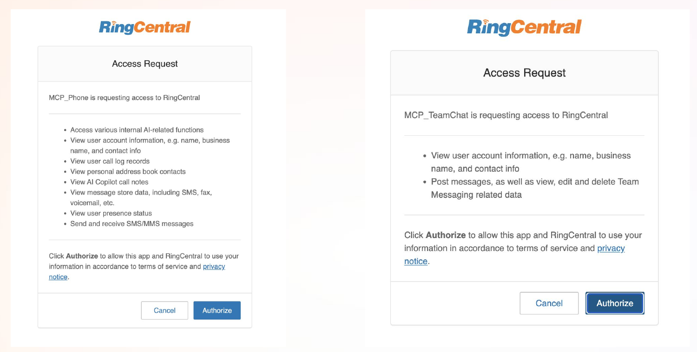

### What you're allowing

| Connector | Claude can |
|-----------|-----------|
| **RingEX Phone** (MCP_Phone) | Use AI-related functions; view your account info, call log, personal contacts, AI Copilot call notes, messages (SMS, fax, voicemail), and presence; send and receive SMS and MMS |
| **RingCentral Chat** (MCP_TeamChat) | View your account info; post messages; view, edit, and delete Team Messaging data |

### Step 9 — Check that both are connected

Return to the **Connectors** tab. Both rows should now read **Connected**:

- **RingEX-Phone**: Connected
- **RingCentral Chat**: Connected

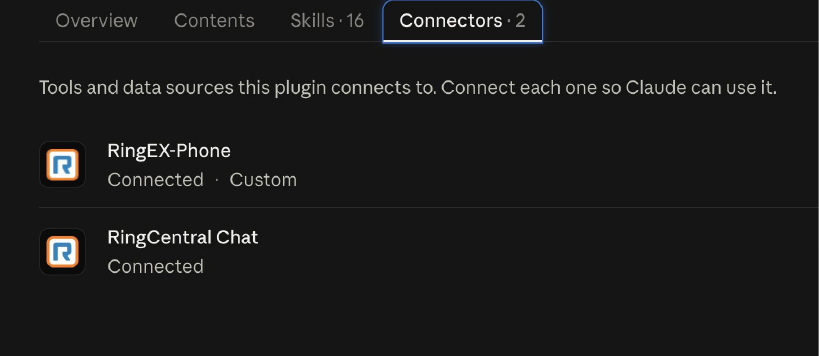

---

## Part 4: Put RingCentral to work — 6 things to try

Open a new chat and try these. Swap in your own names.

### 1. Look up a colleague

**Type this in Claude:**
```
Who is [colleague name]?
```

Or run the skill directly: `` `/colleague-lookup [colleague name]` `` (replace `[colleague name]` with an actual name). Claude searches your company directory and returns:

- Name and job title
- Extension and phone number
- Department
- Current status, like **Available**
- Source, like **company directory**

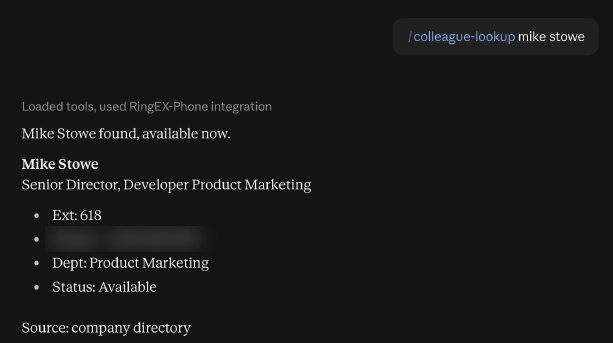

### 2. Check if someone is free

**Type this in Claude:**
```
Is [colleague name] available now?
```

Claude checks their RingCentral presence and answers in one line.

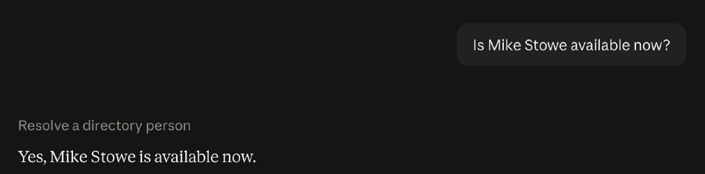

### 3. Send a Team Chat message

**Type this in Claude:**
```
Message [colleague name] and tell them their webinar is going great!
```

1. Claude finds the person in your directory.
2. It shows a preview: **To:** [name] (Team Chat), **Message:** "Your webinar is going great!"
3. It asks: "Confirm and I'll send it."
4. Reply yes. Claude confirms: "Sent to [name]."

!!! tip "You stay in control"
    Claude always shows you the message and waits for your yes before it posts anything.

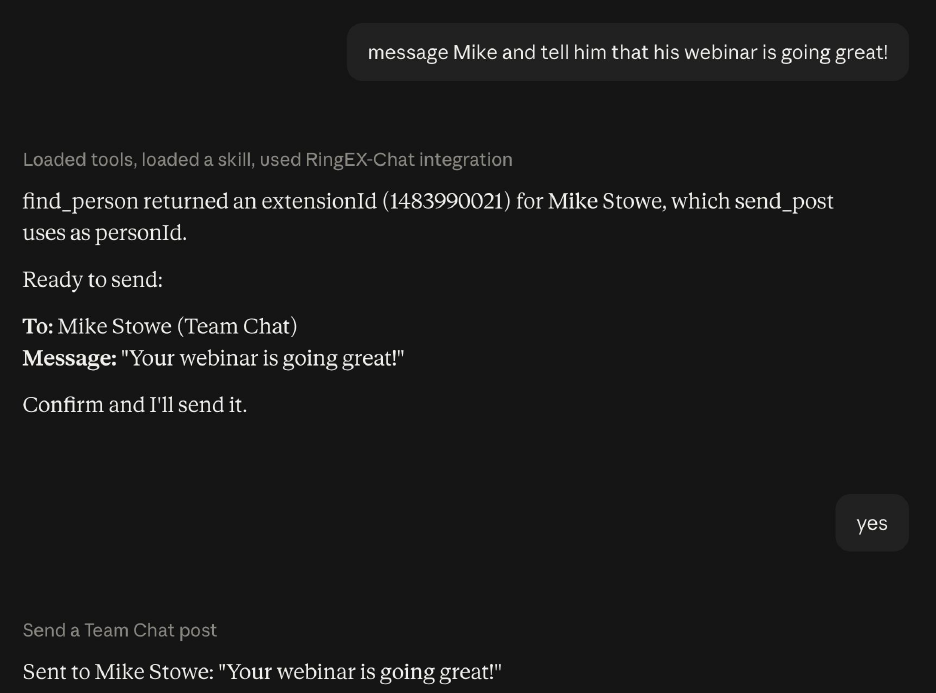

### 4. Catch up on voicemail

**Type this in Claude:**
```
/voicemail-inbox retrieve the latest voicemail and summarize what it says.
```

Or type `` `/voicemail-inbox` `` and Claude will prompt you for what to do next.

Claude returns the latest voicemail with:

- Caller name and number
- Time and duration
- Whether the caller is in your contacts
- The full transcript

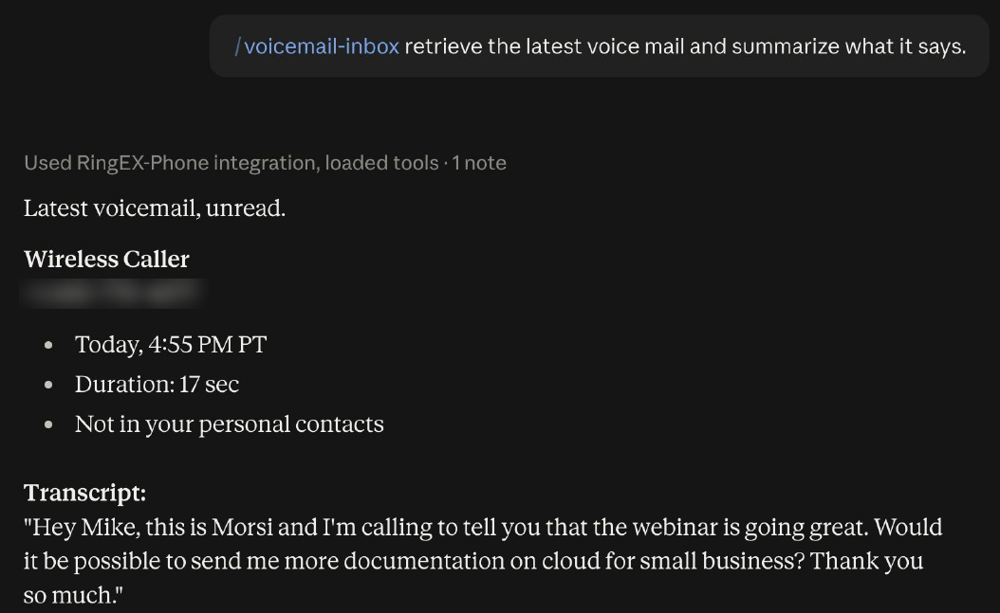

### 5. Follow up on a call by email

**Type this in Claude:**
```
Create a follow-up email for my call with [contact name]
```

Or type `` `/call-followup-email` ``. Here's what happens:

1. Claude checks your recent calls and lists the best candidates.
2. It asks: "Which call should I draft the follow-up email for?" Pick one.
3. It drafts the email with **To**, **Subject**, and a short recap of the call.

No email connector yet? Claude hands you a draft to send yourself, or offers to post it in Team Chat.

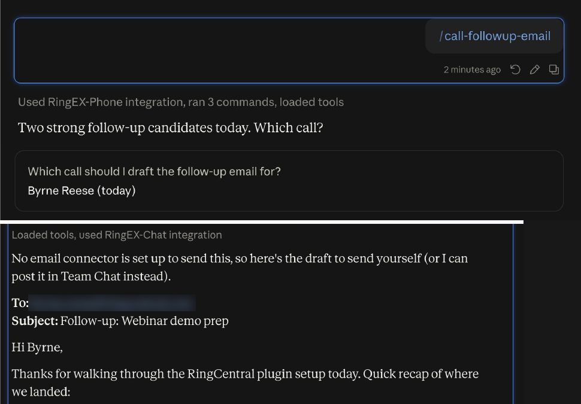

### 6. Get your daily digest

**Type this in Claude:**
```
/daily-communications-digest in a nicely formatted html page
```

Or run `` `/daily-communications-digest` `` directly.

Claude builds a one-page digest of the last 24 hours:

| Section | What it shows |
|---------|--------------|
| **Top priorities** | Numbered to-dos, like "Reply to voicemail" or "Call back" |
| **Unreturned calls** | Missed calls with a **Call back or text** action |
| **Voicemail needing attention** | Unread voicemail with the transcript and a next step |
| **Other notable activity** | Everything else worth a glance |

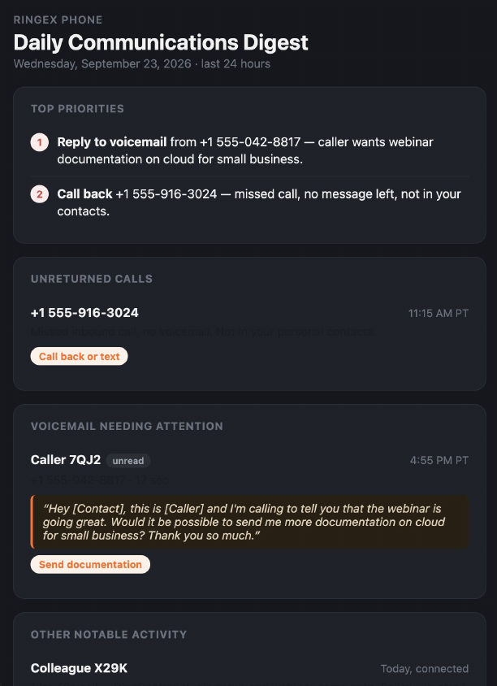

---

## Part 5: Add Claude for Small Business

RingCentral covers your communications. Claude for Small Business adds ready-made workflows for cash, sales, customers, and operations.

### Step 10 — Search for the plugin

Open **Customize**, select **Plugins**, then **Discover**. Enter `small business` in the search box.

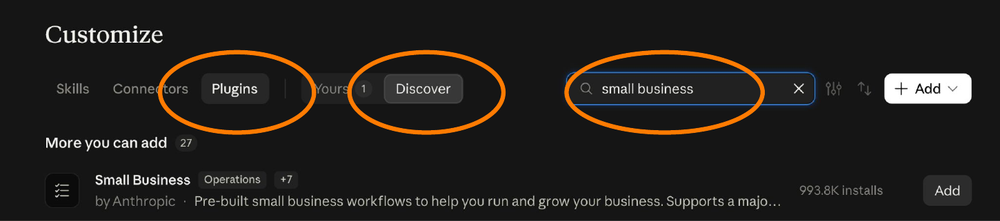

### Step 11 — Add Small Business by Anthropic

Find **Small Business** **by Anthropic**: "Pre-built small business workflows to help you run and grow your business." Click **Add**.

### Step 12 — Confirm it's on

The plugin page opens with the toggle on. You'll see the **Overview**, **Contents**, **Skills**, and **Connectors** tabs.

The description sets the ground rule: "You approve every step that touches money or customers. Install and then ask Claude to help you get onboarded."

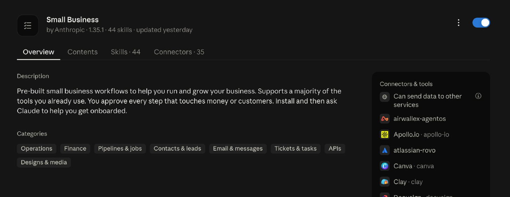

---

## Part 6: Onboard in one chat

### Step 13 — Start onboarding

In the chat box, type `` `/smb-onboard` `` and press send.

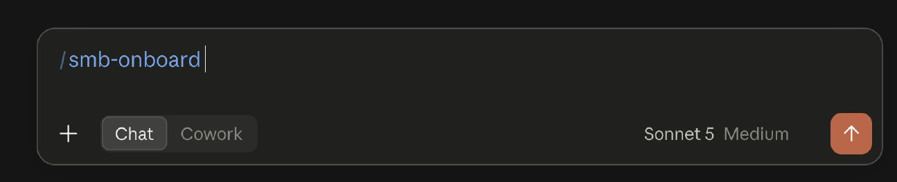

Claude tells you setup takes about 15 to 20 minutes. It checks what's already connected, like RingCentral Team Chat, then asks: **"What are your biggest day-to-day headaches right now?"**

| Pick | Covers |
|------|--------|
| **1. Money** | Cash flow, invoices, bills, payroll |
| **2. Customers** | Following up with leads, keeping repeat business |
| **3. Scheduling** | A packed calendar or too many meetings |
| **4. Getting organized** | Email, files, and general chaos |
| **5. Hiring** | Job posts, screening applicants |
| **6. Selling online** | Orders and stock |

### Step 14 — Answer the question

Pick one or more, or describe it in your own words. Claude uses your answer to choose the first two tools to connect. Then it runs a quick example on your real data.

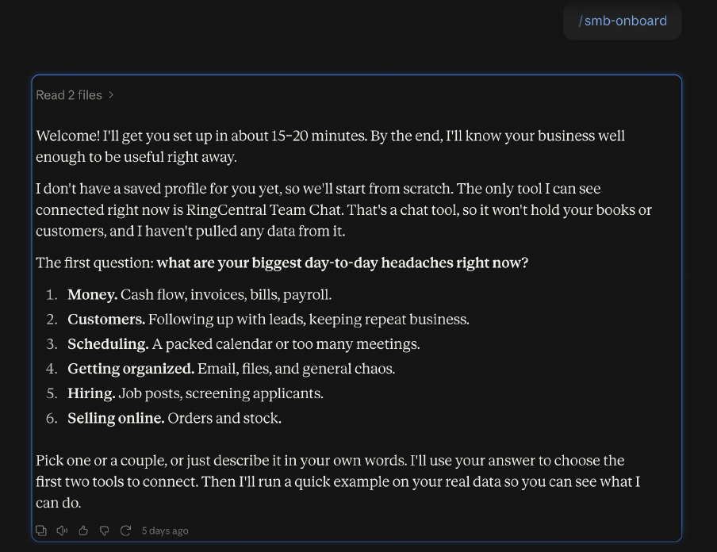

---

## Part 7: See your whole business on one page

**Type this in Claude:**
```
/business-pulse
```

Or just ask: "How's the business doing?" Claude will run `` `/business-pulse` `` automatically. Claude pulls from every connected tool and builds a Business Pulse:

| Section | What you get |
|---------|-------------|
| **Status line** | Date range and a one-line read, like "Cash steady, one collection and one soft month to watch" |
| **#1 priority** | The single most important action, with the contact and owner |
| **Key numbers** | Cash, open receivables, monthly revenue, and weighted pipeline, each vs. last month |
| **Cash & Finance** | Current vs. late receivables, overdue invoices, and bills to pay this week |
| **Pipeline** | Deal value by stage, from New Lead to Closed Won, plus deals that need a nudge |
| **This Week** | Dated commitments: decisions, follow-ups, closes, and scheduled work |

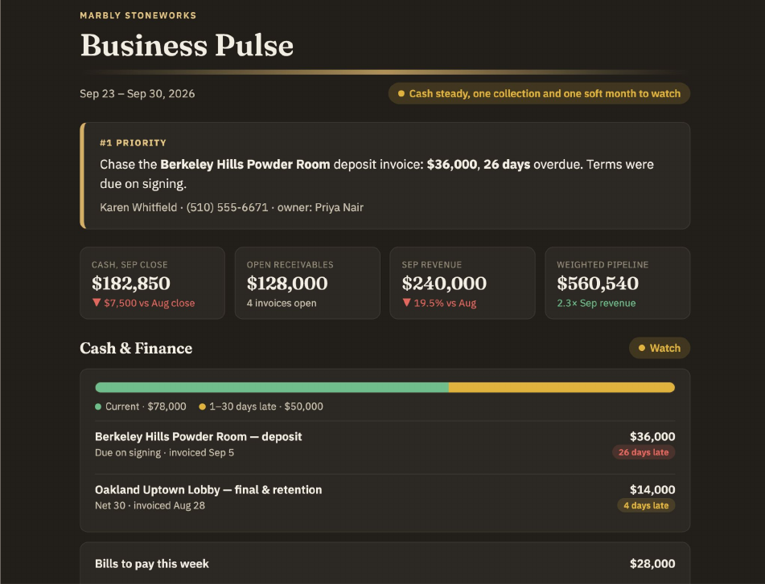

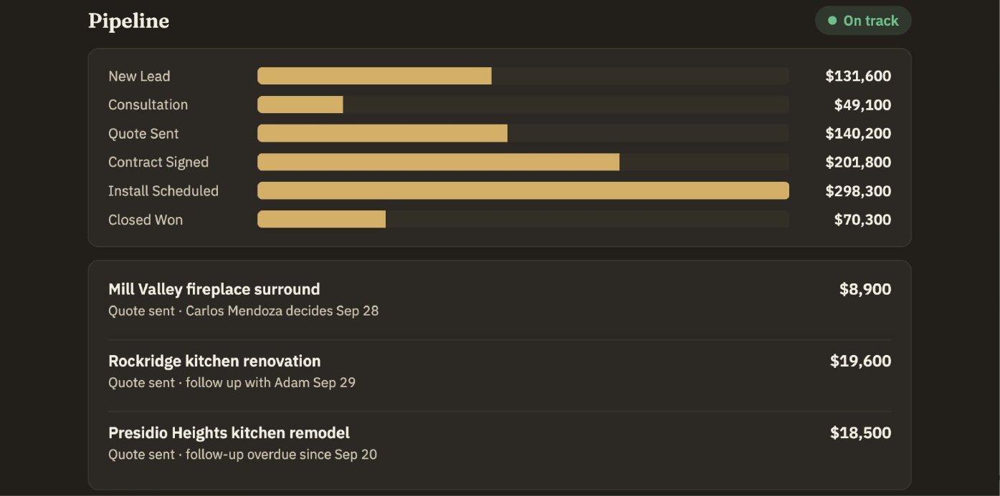

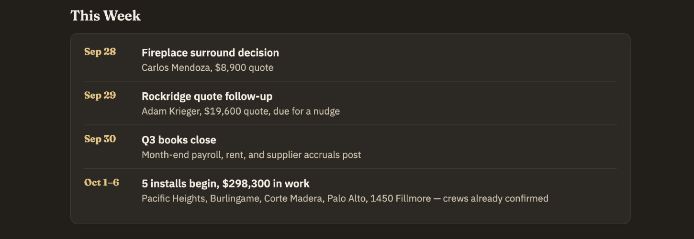

---

## Part 8: Connect your CRM

### Step 15 — Pick your CRM and click Connect

When Claude needs deal data, it shows a **Connectors that could help** card. Options include:

- **HubSpot**
- **monday.com**
- **Salesforce - Beta**
- **Zoho CRM**

Click **Connect** next to yours, sign in, and approve access. You can also add it anytime from **Customize** > **Connectors**.

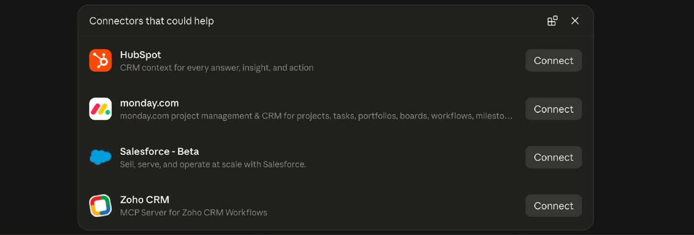

---

## Part 9: Log calls to deals automatically

This is where RingCentral and your CRM work together. Claude reads the call, finds the matching deal, and updates it.

### Step 16 — Run CRM Autopilot

Type `` `/crm-autopilot` ``. Claude asks: **"What do you want CRM Autopilot to do?"**

| Option | What it does |
|--------|------------|
| **1. Standing sweep** | Log everything new since last run: emails, meetings, calls |
| **2. Log one thing** | Record a specific email, meeting, or call transcript against a deal |
| **3. Follow-up on quiet deals** | Find stalled deals and draft next-step outreach |
| **4. Hygiene audit** | Check for duplicates, stale records, missing fields |
| **Something else** | Describe what you need in your own words |

Claude pulls the call from RingCentral and lays out four parts:

- **The call**: date, time, length, and who you spoke with
- **Matched record**: the deal, its stage, value, owner, and next step on file
- **Activity to log**: a summary of what the customer said
- **Proposed field updates (your call)**: new stage, next step, and timeline

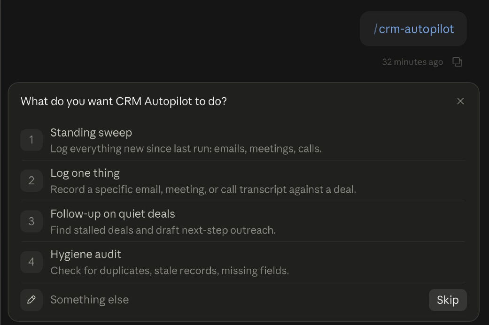

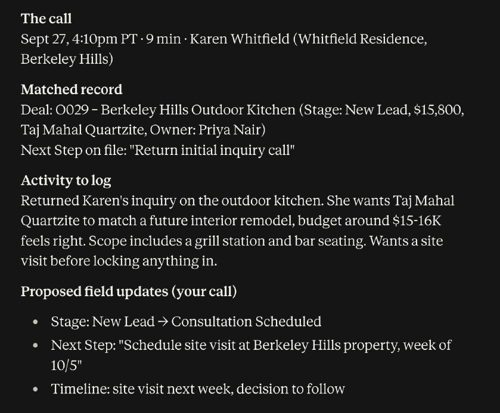

### Step 17 — Approve the update

Reply:

```
Can you log this into the CRM
```

Claude reports **What changed**: the call is added as an activity, and the deal's next step is updated. Stage changes wait for your approval.

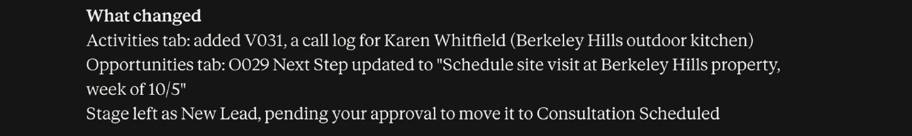

!!! tip "You approve the big moves"
    Claude logs the activity and next step, but leaves the deal stage as is until you say yes.

---

## Part 10: Call new leads back first

**Type this in Claude:**
```
/speed-to-lead
```

Or run `` `/speed-to-lead` `` directly.

Claude turns a new voicemail into a lead you can act on right away:

- **Headline**: like "New lead: kitchen remodel, ready to buy, wants a callback today"
- **Lead card**: name, phone, email, location, and source (for example, a voicemail left before opening)
- **What they want**: the project details, pulled from the message

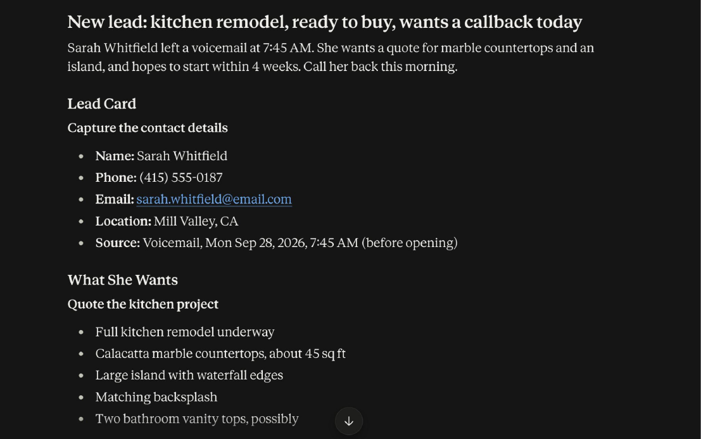

---

## Part 11: Turn a week of voicemails into a lead board

Voicemails pile up fast. One prompt reads them all, matches each caller to your CRM, and drafts every reply. You just review and send.

### Step 18 — Paste this prompt

Copy the full prompt below into a new chat. Swap **[your CRM]** for the CRM you connected in Part 8.

```
Run `` `/speed-to-lead` `` using my RingEX phone voicemails as the inbound source.

Read my unread voicemails and their transcriptions for the last 7 days. Include missed calls with no voicemail as callback tasks. Match each caller to [your CRM] by phone number.

Sort each one as hot, qualified, unclear, or out of scope. Draft a reply in the channel the contact prefers, text or email. Put hot ones first with the owner's name and one next step.

Show a visual board with copy buttons. Do not send anything without my approval.
```

### What Claude does

1. Reads your unread voicemails and transcripts from the last 7 days.
2. Adds missed calls with no voicemail as callback tasks.
3. Matches each caller to your CRM by phone number.
4. Sorts every lead: **hot**, **qualified**, **unclear**, or **out of scope**.
5. Drafts a reply by text or email, based on what the contact prefers.
6. Puts hot leads first, each with an owner and one next step.
7. Builds a visual board. Nothing is sent.

### What the board shows

| Section | What you get |
|---------|-------------|
| **Headline** | How many leads need a person today, who owns each, and "Nothing has been sent" |
| **Score tiles** | Counts for Hot, Qualified, Unclear, and Out of scope, plus the oldest unanswered message |
| **Filters** | All leads, live RingEX leads, or sample data |
| **Lead card** | Tags (like **Hot** or **Flag: timing request**), a one-line summary, and the owner's next step |
| **Lead details** | Owner, CRM match (or new lead), proposed deal and value, and what the caller asked for |
| **Transcript** | The full voicemail, with its length |
| **Draft reply** | A ready-to-send text or email with a **Copy text** button |

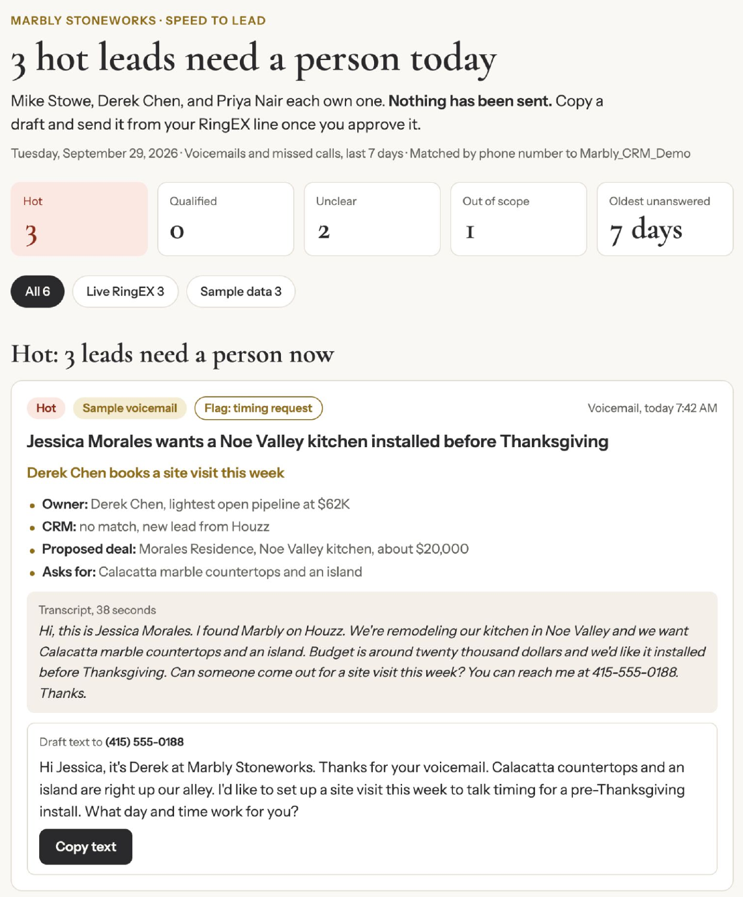

### Step 19 — Review, copy, and send

Read each draft. Click **Copy text**, then send it from your RingEX line.

!!! tip "Nothing goes out on its own"
    The board tells you "Nothing has been sent." You approve and send every reply yourself.

---

## Quick reference: Prompts to copy

| You want to | Type this |
|-------------|-----------|
| Find a colleague | Who is [name]? |
| Check availability | Is [name] available now? |
| Send a Team Chat message | Message [name] and tell them ... |
| Check voicemail | `/voicemail-inbox` |
| Follow up on a call | `/call-followup-email` |
| See your day | `/daily-communications-digest` |
| Set up Small Business | `/smb-onboard` |
| See your business | `/business-pulse` |
| Update your CRM | `/crm-autopilot` |
| Catch new leads | `/speed-to-lead` |
| Sort a week of voicemails | The full prompt in Part 11 |

---

## Troubleshooting: Quick fixes

| If you see | Do this |
|-----------|--------|
| A connector reads **Not connected** | Open the plugin's **Connectors** tab, click **Connect**, and finish the **Authorize** step |
| "No email connector is set up" | Copy Claude's draft, or add your email under **Customize** > **Connectors** |
| The plugin doesn't show in search | Select **Discover** and search `ringcentral` or `small business` |
| You want to know what a skill does | Open the [RingCentral skill library](https://developers.ringcentral.com/mcp/skills/) |

---

## What's next

Start each morning with `` `/daily-communications-digest` ``. Run `` `/business-pulse` `` before your weekly planning. Let `` `/speed-to-lead` `` catch every new customer before your competitors do.

Explore every RingCentral skill at [developers.ringcentral.com/mcp/skills](https://developers.ringcentral.com/mcp/skills/).

---

*Setup guide by the RingCentral Team. ~15 minute read.*
